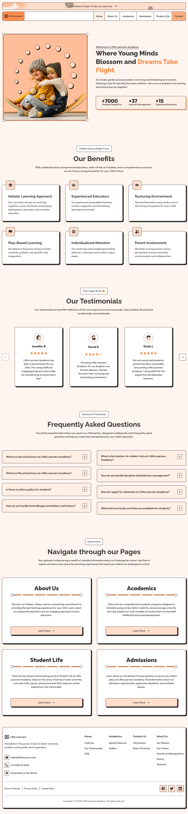
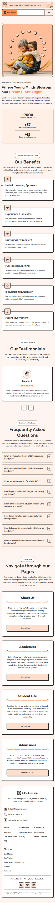

# Little Learners

Little Learners is a responsive educational platform web-site built with **Minista**, using **HTML5, CSS3, and JavaScript** for a clean and maintainable front-end structure. The project focuses on modern layout techniques and reusable components.

🚀 Demo
https://developer-online.com/portfolio/little-learners/

✨ Features

* Fully responsive layout for desktop, tablet, and mobile
* Clean and modern educational UI design
* Reusable component-based structure
* Semantic and accessible HTML markup
* Well-structured styles and maintainable code

🛠 Tech Stack

* **Minista** — static site generator
* **HTML5** — semantic markup
* **CSS3** — styling and responsive layout
* **JavaScript** — UI interactions
* **Vite** — fast development and build tool
* **Responsive layout techniques** — Flexbox and Grid

📷 Screenshots

📌 Project Purpose

This project was created as a portfolio project to demonstrate:

* Responsive layout implementation
* Component-based development with Minista
* Clean and maintainable front-end code
* Modern front-end workflow with Vite

Made as a front-end portfolio project.
